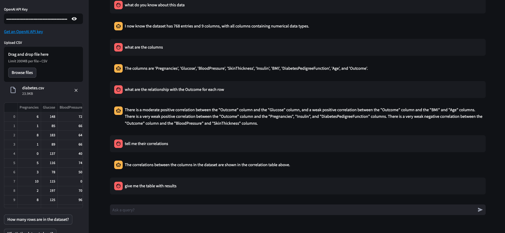

## KeenSight - Health-GPT

Welcome to KeenSight - Health-GPT! This application allows you to interact with a GPT-based chatbot using data from a CSV file. You can ask questions related to the dataset, and the chatbot will provide responses based on the information available.

### Installation

1. Clone this repository to your local machine:

   ```bash
   git clone https://github.com/KeenSightStreamLit/health-gpt.git
   ```

2. Navigate to the project directory:

   ```bash
   cd repo
   ```

3. Install the required dependencies:

   ```bash
   pip install -r requirements.txt
   ```

### Usage

1. Set up your OpenAI API Key by entering it in the provided text input field in the sidebar.
2. Upload a CSV file containing your dataset using the file uploader in the sidebar.
3. Click on the default prompts in the sidebar to ask pre-defined questions about the dataset.
4. Enter custom queries in the chat input field to get responses from the chatbot.
5. Explore the chat history and responses displayed in the main chat window.

### Project Structure

- `main.py`: Contains the main code for running the chatbot application.
- `logo.png`: Logo image used in the user interface.
- `requirements.txt`: Lists the required Python packages for running the application.

### Configuration

- `st.set_page_config`: Configures the Streamlit page title and layout settings.
- `default_prompts`: Pre-defined prompts for asking questions about the dataset.
- `create_agent`: Initializes the OpenAI-based language model and creates a chatbot agent.
- `query_agent`: Sends queries to the chatbot agent and generates responses based on the dataset.

### Getting Started

To run the application:

```bash
python main.py
```

Open your browser and navigate to the provided URL to start chatting with the Health-GPT chatbot using your dataset!

## Example


### Note

Make sure to handle sensitive information such as API keys securely and follow best practices for data privacy and security.

For any questions or issues, feel free to reach out to the project maintainer(s).

Happy chatting! 🤖💬